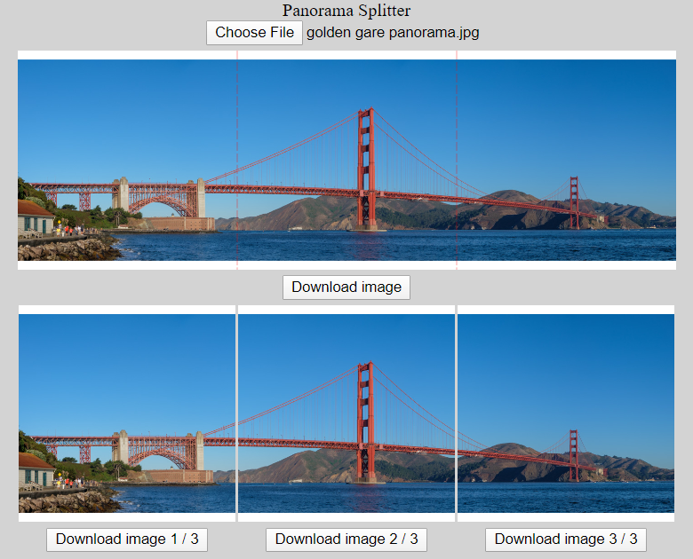

# The app - [Panorama Splitter](https://pano-slicer.netlify.com/)

## pano-slicer
One trick webapp for splitting a horizontal image into multiple files

## Develop
* `npm install`
* `npm run develop` to start webpack watch
* `npm run serve` to serve dist directory
